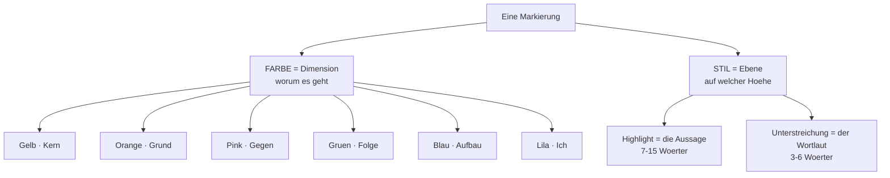
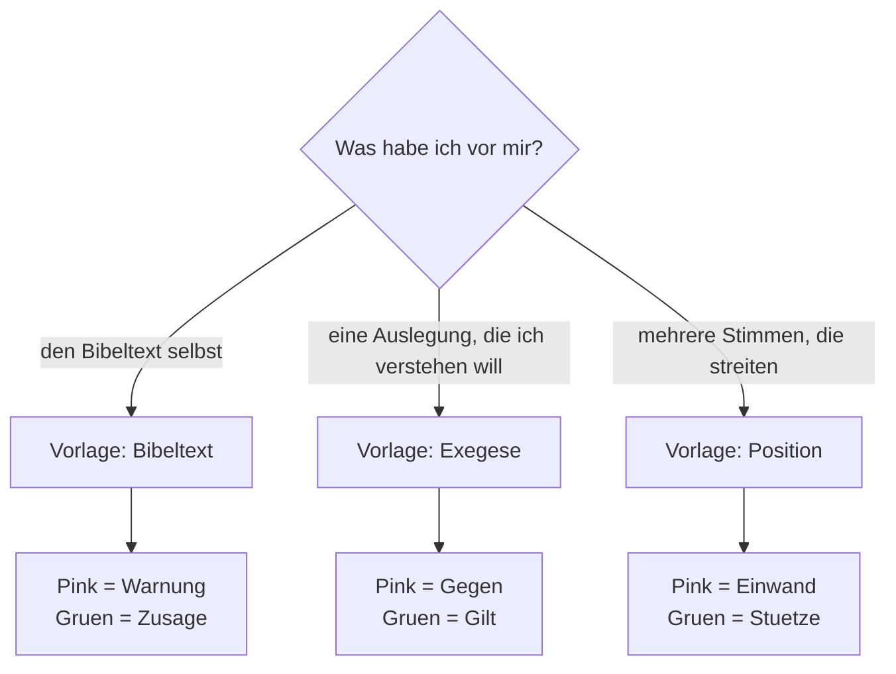

# Markierungs-Vorlagen: Exegese · Position · Bibeltext

Eine Vorlage ändert **nicht**, was eine Farbe bedeutet. Sie benennt nur die zwölf Fächer neu — passend zu der Textsorte, die gerade vor mir liegt. Das ist der ganze Trick: das Raster bleibt fest, die Wörter wechseln.

---

## 1. Das Raster liegt fest

Jede Markierung trägt zwei Informationen. Die **Farbe** sagt, *um welche Dimension* es geht. Der **Stil** sagt, *auf welcher Ebene* ich zugreife.

Merksatz für die sechs Farben: *worum es geht · woher es kommt · wogegen es steht · was folgt · wie es gebaut ist · was ich denke.*

Und für die zwei Stile: **Highlight = was der Text behauptet. Unterstreichung = wie der Text es macht.** Eine gelbe Markierung und eine gelbe Unterstreichung sind dieselbe Idee, eine Ebene auseinander: die These — und das Leitwort, an dem die These hängt.

> Ich ermahne euch nun, Brüder, eure Leiber darzustellen als ein lebendiges, heiliges, Gott wohlgefälliges <u data-color="yellow">Opfer</u>.

Genau deshalb sind Vorlagen so billig zu wechseln: sie verschieben nie eine Farbe in eine andere Dimension, sie geben ihr nur ein passenderes Etikett.

---

## 2. Die drei Vorlagen nebeneinander

**Highlights — die Aussage-Ebene**

| Farbe | Dimension | Exegese | Position | Bibeltext |
| --- | --- | --- | --- | --- |
| Gelb | Kern | Kern | These | Kern |
| Orange | Grund | Grund | Beleg | Grund |
| Pink | Gegen | Gegen | **Einwand** | **Warnung** |
| Grün | Folge | Gilt | **Stütze** | **Zusage** |
| Blau | Aufbau | Aufbau | Aufbau | Aufbau |
| Lila | Ich | Ich | **Urteil** | Ich |

**Unterstreichungen — die Sprach-Ebene**

| Farbe | Dimension | Exegese | Position | Bibeltext |
| --- | --- | --- | --- | --- |
| Gelb | das Wort | Wort | **Begriff** | Wort |
| Orange | der Verweis | Zitat | **Autor** | Zitat |
| Pink | die Negation | Nicht | Nicht | Nicht |
| Grün | der Imperativ | Gebot | **Folgt** | Gebot |
| Blau | der Konnektor | Logik | **Wenn** | Logik |
| Lila | meine Frage | Frage | **Prüfen** | Frage |

Fett markiert ist jeweils, was von *Exegese* abweicht. **Bibeltext unterscheidet sich in genau zwei Fächern** — das ist Absicht: die Handbewegung soll beim Wechsel nicht neu gelernt werden müssen.

---

## 3. Welche Vorlage wann?

Die Faustregel dahinter ist die Frage: **Wer redet in diesem Text?**

- **Bibeltext** — der Text redet *mich* an. Deshalb heißen die Pole hier nicht analytisch (Gegen / Gilt), sondern seelsorglich: **Warnung** und **Zusage**. Ich lese nicht über den Text, ich stehe darunter.
- **Exegese** — jemand erklärt mir einen Text, und ich will die Erklärung *nachvollziehen*. Der Standardfall. Pink ist hier die Abgrenzung (»so ist es gerade nicht gemeint«), Grün das, was der Text bejaht.
- **Position** — mehrere Autoren behaupten Unterschiedliches, und ich muss *sortieren, wer was sagt*. Deshalb gibt es hier als einziger Vorlage einen eigenen Slot für den **Autor** (Orange unterstrichen) und für mein **Urteil** (Lila).

---

## 4. Drei durchmarkierte Beispiele

### Bibeltext — Römer 12,1–2

> Ich ermahne euch <u data-color="blue">nun</u>, Brüder, <u data-color="orange">durch die Erbarmungen Gottes</u>, <mark data-color="yellow">eure Leiber darzustellen als ein lebendiges, heiliges, Gott wohlgefälliges <u data-color="yellow">Opfer</u></mark>, was euer vernünftiger Gottesdienst ist. Und <u data-color="green">seid</u> nicht <mark data-color="pink">gleichförmig dieser Welt</mark>, <u data-color="pink">sondern</u> <u data-color="green">werdet verwandelt</u> durch die Erneuerung des Sinnes, <mark data-color="green">dass ihr prüfen mögt, was der Wille Gottes ist: das Gute und Wohlgefällige und Vollkommene</mark>.

- **Blau unterstrichen** »nun« — das οὖν. Ein einziges Wort, das elf Kapitel Lehre an die Mahnung anschließt. Der Konnektor ist hier fast die wichtigste Markierung im Abschnitt.
- **Orange unterstrichen** »durch die Erbarmungen Gottes« — die Verweisformel: *worauf* sich die Mahnung stützt.
- **Gelb** die Kernaussage, und *in ihr* gelb unterstrichen das Leitwort »Opfer«. Dieselbe Farbe, zwei Ebenen — genau die Überlappung, für die das System gebaut ist.
- **Pink** »gleichförmig dieser Welt« ist die Warnung; pink unterstrichen das »sondern«, das den Umschlag im Wortlaut markiert.
- **Grün** die Zusage am Ende; grün unterstrichen die Imperative »seid« und »werdet verwandelt«.

Nach dieser Markierung lässt sich der Abschnitt in einem Satz nacherzählen, ohne ihn nochmal zu lesen: *Weil (blau) Gott sich erbarmt hat (orange), gilt: Leib als Opfer (gelb) — nicht Weltform (pink), sondern Verwandlung, damit ihr Gottes Willen prüft (grün).*

### Exegese — ein Kommentarsatz

> <mark data-color="yellow">Paulus überträgt die Opfersprache vom Kult auf das ganze Leben</mark>. <u data-color="yellow">λογικὴ λατρεία</u> meint also <u data-color="pink">nicht</u> <mark data-color="pink">einen fortgeschriebenen Tempelkult</mark>, <u data-color="pink">sondern</u> <mark data-color="green">den Alltag als Ort des Gottesdienstes</mark>. <u data-color="blue">Denn</u> <mark data-color="orange">schon <u data-color="orange">in Röm 6,13</u> lässt Paulus die Glieder als Waffen der Gerechtigkeit »darstellen«</mark>; <mark data-color="blue">die Opfersprache läuft seit Kapitel 6 durch</mark>. <mark data-color="purple">Dann wäre 12,1 keine neue Ethik, sondern die Ernte von 6–8</mark> <u data-color="purple">— gilt das auch für 12,2?</u>

Hier arbeitet das Paar Pink/Grün als **Zange**: Pink hält fest, was der Ausleger *ausschließt*, Grün, was er *setzt*. Wer nur Grün markiert, verliert die Hälfte des Arguments — eine These wird erst scharf durch das, wogegen sie steht.

Lila kommt zweimal vor und meint zweierlei: **Lila markiert** ist mein Gedanke (eine Hypothese, die im Text so nicht steht), **lila unterstrichen** meine offene Frage. Beides gehört bewusst in denselben Text und nicht in ein separates Notizfeld — sonst verliert der Gedanke die Stelle, an der er entstanden ist.

### Position — zwei Forscher im Streit

> <u data-color="orange">Käsemann</u> sieht in Röm 12,1 <mark data-color="yellow">den Beginn der <u data-color="yellow">Paränese</u>, die als Konsequenz aus dem Indikativ von Kap. 1–11 <u data-color="green">folgt</u></mark>. <u data-color="orange">Betz</u> hält dagegen: <mark data-color="pink">die Kapitel 12–15 seien eine eigenständige Mahnrede</mark> und <u data-color="pink">nicht</u> aus 1–11 ableitbar. <u data-color="blue">Wenn</u> <mark data-color="green">das οὖν in 12,1 tatsächlich zurückgreift</mark>, stützt das Käsemann. <mark data-color="purple">Ich halte den Einwand für formgeschichtlich stark, aber textlich schwach</mark>. <u data-color="purple">Betz zum οὖν selbst nachlesen.</u>

Der entscheidende Unterschied zu *Exegese*: **Orange unterstrichen ist hier der Autor**, nicht die Belegstelle. In einer Debatte ist die teuerste Information, wer was gesagt hat — vier Wochen später weiß ich noch, dass jemand die Mahnrede-These vertreten hat, aber nicht mehr, wer.

Und **Gelb unterstrichen ist der strittige Terminus** (»Paränese«). Fast jede Debatte hängt an einem Wort, das die Beteiligten verschieden füllen. Wer es unterstreicht, sieht beim Wiederlesen sofort, wo der Streit wirklich sitzt.

---

## 5. Bedienung: Ersetzen oder Ergänzen?

Eine Vorlage anwenden heißt: **ihr Schema wird in dieses Nugget kopiert.** Es bleibt danach keine lebende Verbindung — ändere ich später die Vorlage, ändert sich dieses Nugget nicht. Das ist gewollt: eine alte Notiz soll nicht rückwirkend umbenannt werden.

Weg dorthin: Markierungen-Popup → **Legende** → »Übernehmen von …« → Abschnitt **Vorlagen**.

Habe ich in diesem Nugget schon eigene Namen vergeben, kommt die Rückfrage:

- **Ersetzen** — die Vorlage gilt 1:1, meine eigenen Namen fallen weg.
- **Ergänzen** — meine eigenen Namen gewinnen, die Vorlage füllt nur die leeren Fächer.

**Ergänzen ist fast immer der richtige Knopf.** Genau dafür ist es gebaut: Wenn ich in einem Nugget Pink mit »Leiden–Bedrängnis–Schmach–Tod« belegt habe, weil dieser eine Text ein Wortfeld durchspielt, dann soll eine später aufgesetzte Vorlage das nicht plattmachen. Sie soll nur die elf Fächer benennen, für die ich noch nichts Eigenes hatte.

Zwei Details, die im Alltag auffallen:

- **Namen sind auf 7 Zeichen begrenzt.** Nicht aus Willkür — die Beschriftung unter den Farbfeldern muss auf einem schmalen iPhone sechsmal nebeneinander passen. Der Langtext steht im **Glossar** (Buch-Symbol in der Legende) und ist für alle Leser sichtbar, nicht nur für mich.
- **Eigene Vorlage anlegen:** Fächer im Nugget benennen, dann in der Legende »Als Vorlage speichern«. Die drei mitgelieferten Vorlagen lassen sich umbenennen, aber nicht löschen.

---

## 6. Warum das Raster nie mitwandert

Die Vorlage benennt die Fächer — die **Dimension hängt allein an der Farbe** und ist von der Vorlage unabhängig. Das klingt nach einer Detailentscheidung, ist aber der Grund, warum das Ganze über den Einzeltext hinaus trägt:

Weil die Dimension ohne jede Konfiguration aus der Farbe folgt, kann **Denkspuren** in der Ansicht *Nach Dimension* alle Markierungen des ganzen Korpus in dieselben sechs Eimer schütten — egal, welche Vorlage im jeweiligen Nugget lag, und auch für Nuggets, die nie eine Vorlage bekommen haben.

Praktisch heißt das: Ich kann alles zusammen ansehen, wogegen sich meine Texte wehren (Pink), oder alles, was ich selbst hinzugedacht habe (Lila) — quer über Bibeltext, Kommentar und Debatte hinweg. Hätte die Vorlage die Bedeutung der Farbe verschoben, wäre genau diese Frage nicht mehr stellbar; »Warnung« und »Einwand« lägen dann in verschiedenen Eimern, obwohl beide dasselbe tun: sie halten fest, wogegen der Text steht.

**Deshalb: die Farbe ist die Grammatik, die Vorlage nur das Vokabular.**
